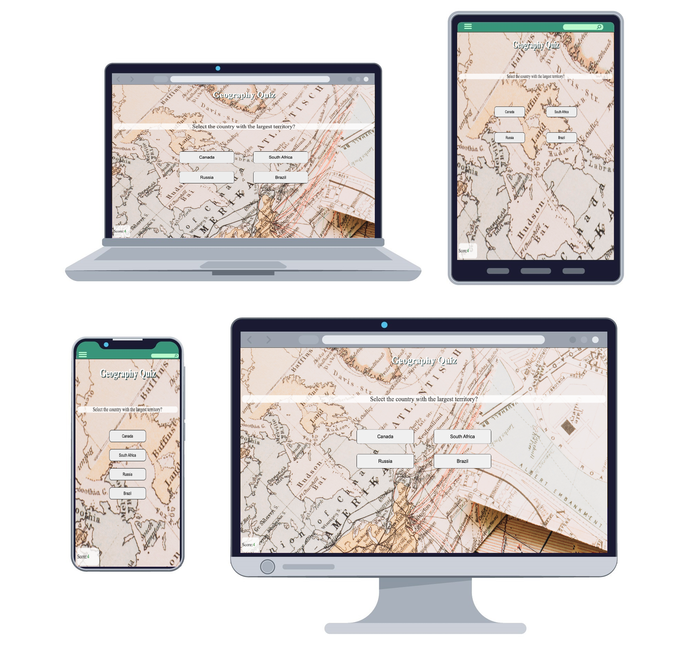
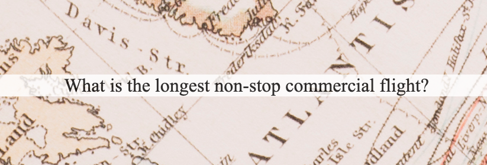
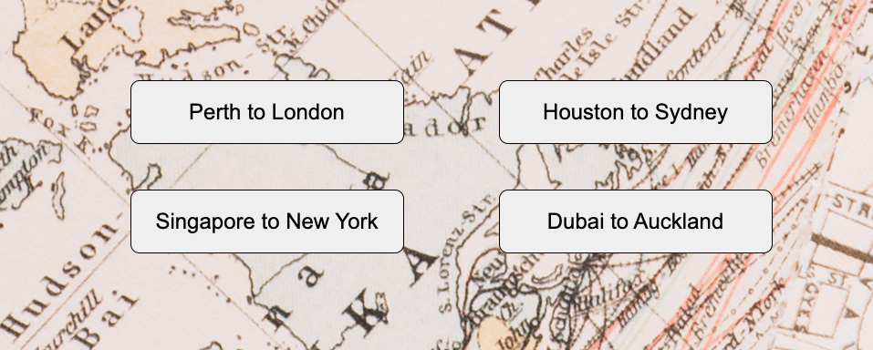
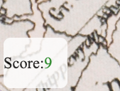

# Geo Quiz
Geo Quiz is a website that hopes to provide a challenging and fun quiz using the core concepts of javascript and UX design. This site is targeted toward those who wish to see an example of how quizes, a common form of entertainment or learning tool, can be created by using basic javascript concepts. Geo Quiz is a simple and fully responsive website that keeps score of your result and can be played on a wide range or devices. The way this code was constructed allows for easy addition of questions and possible choices as well as ability to change the topic of the questions in future iterations.

## Features 

### Existing Features

- __The Question Section__

    - This section displays questions as soon as the pages has loaded and has a white background to highlight the constant position of the questions. The section is placed above the 4 choices to pick and cycle when a choice is clicked.  

- __The Choices Section__

    -  This section is located under the questions section and displays 4 seperate buttons in which a black border appears on the button that is hovered over. The choices cycle and switch to the new choices once one of the choices is clicked.

- __The Score Area__

    -  The score area section is located in the bottom left of the screen and will alaways stay at the bottom on any screen size. The score area number updates when a correct choice is cliked. The score area number is green to highlight when a correct choice is made.

  
### Features Left to Implement

- In future iterations of this game, the questions will display in a different order after the game is restarted 
- More questions will be added in future interations

## Testing 

### Validator Testing 

- HTML
    - No errors issues from the HTML Validator [W3C HTML Validator](https://validator.w3.org/nu/?doc=https%3A%2F%2Fcode-institute-org.github.io%2Flove-maths%2F)
- CSS
    - No errors issues from the CSS Validator [W3C CSS Validator](https://jigsaw.w3.org/css-validator/validator?uri=https%3A%2F%2Fsimonepietraroia.github.io%2FGeography-Quiz%2F&profile=css3svg&usermedium=all&warning=1&vextwarning=&lang=en)
- JavaScript
    - No errors were found when passing through the official Jshint validator
        - The following metrics were returned:
        - There are 2 functions in this file.
        - Function with the largest signature takes 1 arguments, while the median is 0.5.
        - Largest function has 9 statements in it, while the median is 7.
        - The most complex function has a cyclomatic complexity value of 3 while the median is 2.5.
### Unfixed Bugs

There is an issue with the buttons with the answers shaking when hovered on. The location of the bug hasn't been found.

## Deployment

The site was deployed to GitHub pages. The steps to deploy are as follows:
In the GitHub repository, navigate to the Settings tab
From the source section drop-down menu, select the main Branch
Once the main branch has been selected, the page will be automatically refreshed with a detailed ribbon display to indicate the successful deployment.

The live link can be found here - https://simonepietraroia.github.io/Geo-Quiz/

## Credits 

### Content 

- The answer to these questions were found on [Wikipedia](https://www.wikipedia.org/)
- The site [W3C](https://www.w3schools.com/spaces/) was used as an external source to deal with coding issues.

### Media

- The background images of this game was found on [Freepik.com](https://www.freepik.com/)
- The favicon was taken from [Freepik.com](https://www.freepik.com/) and converted on [favicon.io](https://favicon.io/)
